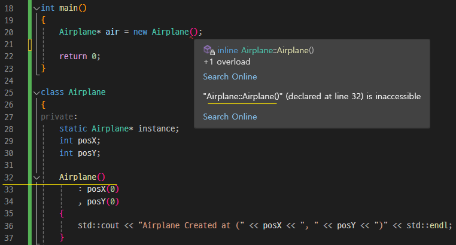
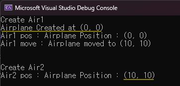

**🔻임의 생성 방지**



Airplane 클래스 구현시 기본생성자를 private 접근제한자로 만들었다.</br>
이 때문에 외부에서 객체를 임의의로 생성할 수 없다.</br>
오직 getInstnace() 함수를 통해서만 Airplane 클래스의 인스턴스를 얻을 수 있다.</br>

**🔻하나뿐인 객체**

```cpp
int main()
{
	Airplane* air1 = Airplane::getInstance();
	air1->getPosition();
	air1->move(10, 10);

	Airplane* air2 = Airplane::getInstance();
	air2->getPosition();

	return 0;
}
```



main 함수의 결과는 위와 같으며, air1 과 air2 를 생성할 때, 차이점이 존재한다.</br>
air1 의 경우 생성시 `"Airplane Created at (0, 0)"` 와 같은 문구가 출력되지만, air2의 경우 그렇지 않다.</br>

또한, air2는 생성하자마자 air1과 같은 곳에 위치하고 있다.

이를 통해 Singleton 패턴으로 구현한 Airplane 클래스에선 하나의 인스턴스만 존재한다는 것을 알 수 있다.