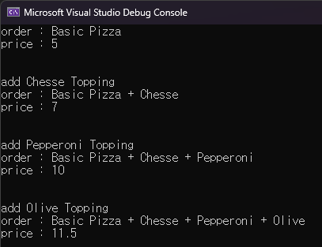

**🔻동적 확장**

```cpp
int main()
{
	// 기본 피자 주문
	Pizza* pizza = new BasicPizza();
	std::cout << "order : " << pizza->getName() << std::endl;
	std::cout << "price : " << pizza->getPrice() << std::endl;

	// 치즈 토핑 추가
	std::cout << "add Chesse Topping" << std::endl;
	pizza = new CheeseDecorator(pizza);
	std::cout << "order : " << pizza->getName() << std::endl;
	std::cout << "price : " << pizza->getPrice() << std::endl;

	// 페페로니 토핑 추가
	std::cout << "add Pepperoni Topping" << std::endl;
	pizza = new PepperoniDecorator(pizza);
	std::cout << "order : " << pizza->getName() << std::endl;
	std::cout << "price : " << pizza->getPrice() << std::endl;

	// 올리브 토핑 추가
	std::cout << "add Olive Topping" << std::endl;
	pizza = new OliveDecorator(pizza);
	std::cout << "order : " << pizza->getName() << std::endl;
	std::cout << "price : " << pizza->getPrice() << std::endl;

	return 0;
}
```



main 함수의 결과는 위와 같으며, Pizza 클래스의 수정 없이 getName(), getPrice() 함수를 통해 얻어내는 값에 변화를 주고 있다.

데코레이터 클래스는 피자 객체를 감싸며 동적으로 새로운 기능을 제공하고 있다.

