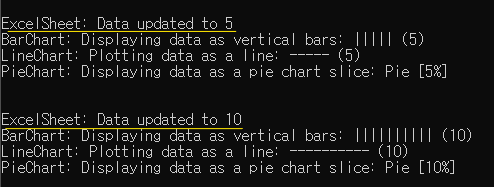

**🔻자동 값 반영**

```cpp
// 데이터 변경 테스트
// - 데이터를 변경하면 등록된 모든 Observer들이 알림을 받고 화면에 갱신
excelSheet.setData(5);  // 데이터 변경: 5
std::cout << "\n\n";
excelSheet.setData(10); // 데이터 변경: 10
```

위 코드이 결과는 아래와 같다.



Excel Sheet 의 역할을 하는 ExcelSheet 클래스의 setData(int) 함수를 호출하여 값을 변경했다.</br>
자동으로 Excel Sheet 를 참조하고 있는 Bar,Line,Pie Chart의 값이 갱신된 것을 확인할 수 있다.